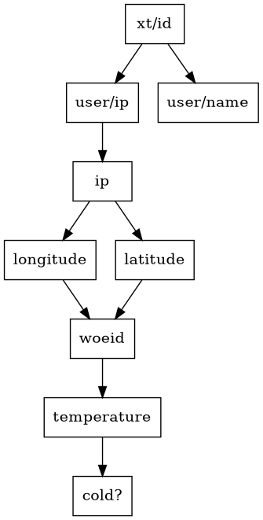

## Pathom3 demo

---

Supporting code for [a Blog Post](https://www.juxt.pro/blog/pathom)

Based on the [Pathom tutorial](https://pathom3.wsscode.com/docs/tutorial)

Simple tool to generate Graphviz visualization of resolvers

Simple [XTDB](http://xtdb.com) integration demo

---
Requirements: [clj tools](https://clojure.org/guides/getting_started)

---




Usage: `clj -X:ip-weather :output OUTPUT [INPUT key value pairs] `


```shell
clj -X:ip-weather :output :cold? :ip '"198.29.213.3"' 

clj -X:ip-weather :output :user/name :xt/id '"wilker"' 

clj -X:ip-weather :output :temperature :xt/id '"wilker"' 
```
